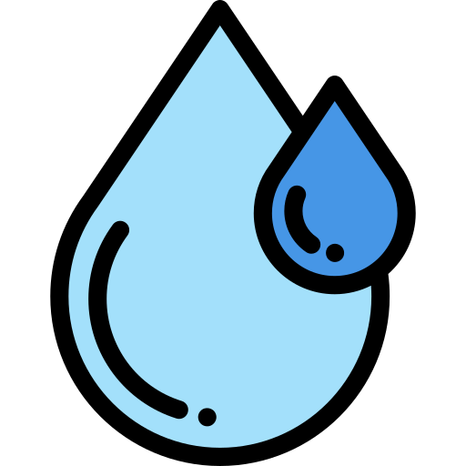

# 마크다운이란 무엇인가? - 가장 중요한 제목
`#`의 표기는 md의 문서에서 제목의 표기

## 두번째로 중요한 제목
### 세번째로 중요한 제목
#### 네번째로 중요한 제목
##### 다섯번째로 중요한 제목
###### 제목 형태 중 가장 낮은 레벨

---

## 내용 표기

내용을 표시할 때에는 어떠한 형태가 있으며, <br />
또한 어떠한 표시를 하는가?

> 인용문 : 보통 내용을 작성할 경우는 글을 작성하지만, <br />
문장 또는 단락의 표기를 제목, 강조처리

---

단순히 문장을 작성하였을 경우, 때로는 **굵은 글씨**를,
때로는 *기울임*, 때로는 ~~취소선~~, <ins>밑줄표시</ins>, `<ins>밑줄 사용</ins>`

---

## 목록 표기

### 순서가 없는 리스트

- markdown
- git
-web

---

### 순서가 있는 리스트

1000. html
99999. css
1. javascript

---

### 다단리스트

- 웹을 사용할 때
  1.  여러 단계를 거쳐서 체크
  1. 여러 단계를 거쳐서 체크
  1.  여러 단계를 거쳐서 체크
- 여러 단계를 거쳐서 체크

---

## 링크, 이미지

### 링크

[구글 페이지 이동 : https://google.com](https://google.com)

---

### 이미지


---

#### 이미지 불러오기 테스트




> 웹 / 마크다운에서 사용할 수 있는 이미지는 <br />
> png, jpg, svg 확장자를 가진다.

---

## code

``` html

 <!doctype html>
 <html>
  <head></head>
  <body></body>
 </html>

```